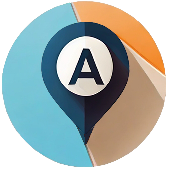
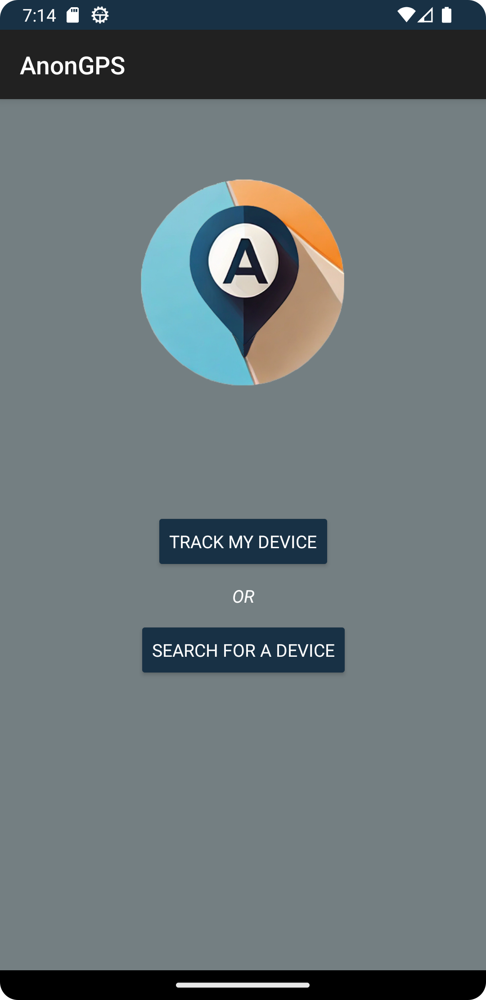
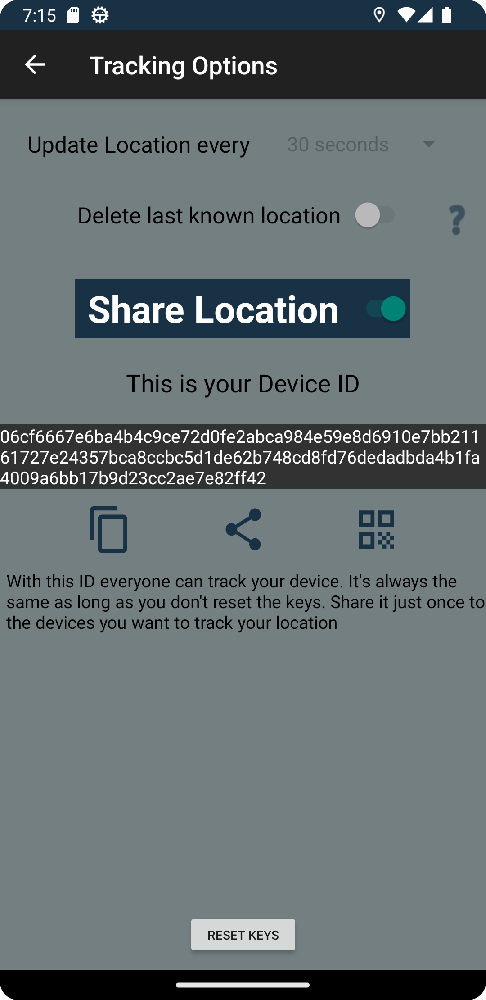
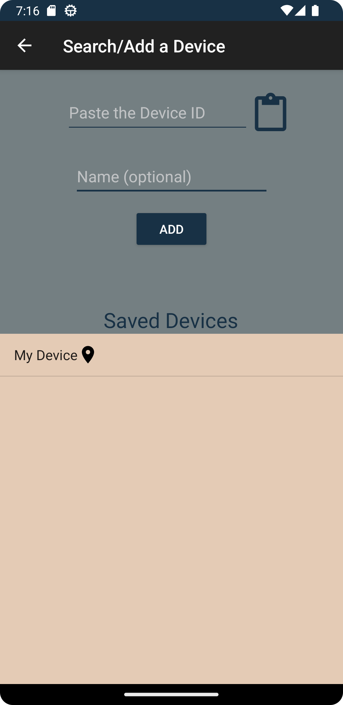
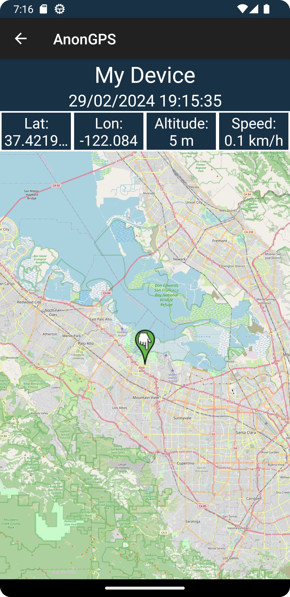

    
<h3 align="center">AnonGPS</h3>

# About
AnonGPS is a simple GPS tracking app for Android offering end-to-end encryption across devices without providing any personal information at all. This app is ideal for situations where location tracking is necessary but privacy is paramount.

The application implements symmetric encryption with AES128 to secure all location data. This ensures that only the target users who receive the key can access the data while anything stored in the database is encrypted without any keys.

## Features
- Track location, altitude and speed
- Real time updates
- No account required. Every device has a Unique ID.
- Share with QR code.
- Reset the cryptographic keys at any time.
- Option to save or not your last known location.

# How to Use

In the home screen there are two options.

    
<h3 align="center">Home Screen</h3>

The "Track my Device" option basically sets up the location service. Also it provides the DeviceID you need to share along with other options for sharing and tracking.

Important Notes:
- Anyone can track your location with the DeviceID. Be careful when sharing this.
- Internet connection and location permission is required for the app to work properly.

    
<h3 align="center">Track my Device</h3>

 

    
<h3 align="center">Search for a Device</h3>

The "Search for a Device" option is where you add the DeviceID you want to track. This can be done either by scanning the QR code with your device's scanner and pasting it to the input or copying it from any other source. Directly below you can see all saved devices. Tap on one to open the map or hold to delete it. *(In the case where the target device has reset the keys, you need to get and add the new DeviceID)*

    
<h3 align="center">Map</h3>

By tapping on a saved device you can see the location on the map and all the shared data. Switch to lanscape orientation for the full coordinates.

# Installation

1. Download the latest APK from the [releases page](https://github.com/nu113d/AnonGPS/releases).
2. Enable installation from unknown sources in your Android device settings.
3. Install the APK on your Android device.

If you want to build the app from source on Android Studio (only for testing), clone the repository, open the project and setup a [Firebase Realtime Database](https://firebase.google.com/docs/android/setup#console) for this project. Inside the database add a path named ``devices``. This is where every new device is saved with its corresponding UUID.

# Contributions
If you find any bugs, problems or have a proposal for improvements feel free to open an issue.

## TODO
- Improve UI
- Add QR scanner
- Copy coordinates from map
- More tracking options
